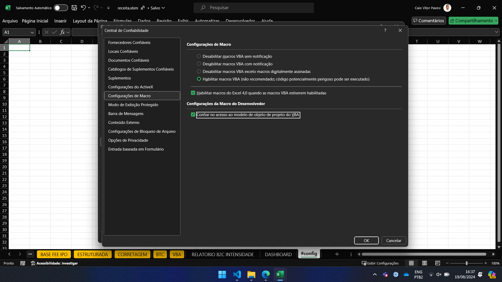

# Macros de planilhas

### Como começar?

Primeiro, assista [este vídeo](https://www.youtube.com/watch?v=xoO-Fx0fTpM) que explica como usar o xlwings para editar macros no VSCODE, acredite vai mlhorar sua produtividade.

Caso você tenh problemas, vá para a central de confiabilidade e confira se suas configurações estão desta forma:

